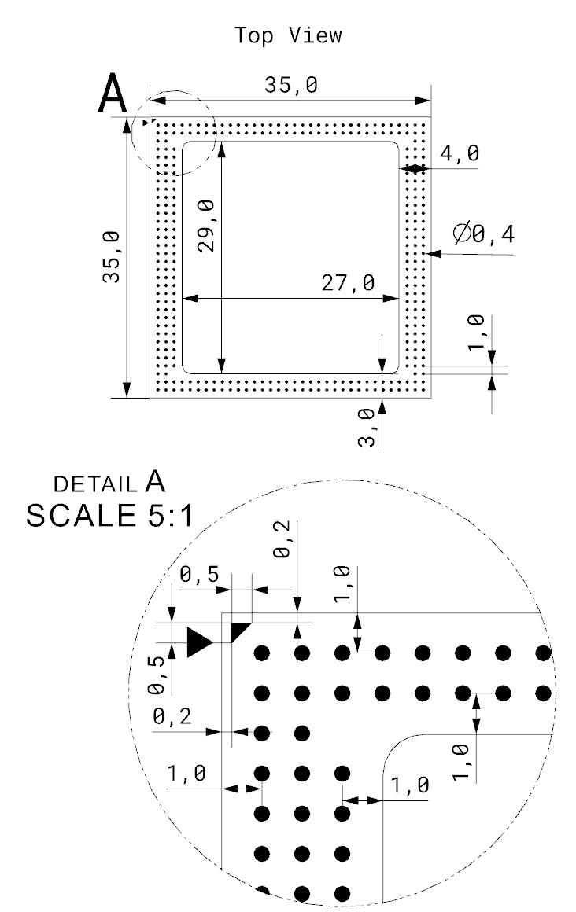
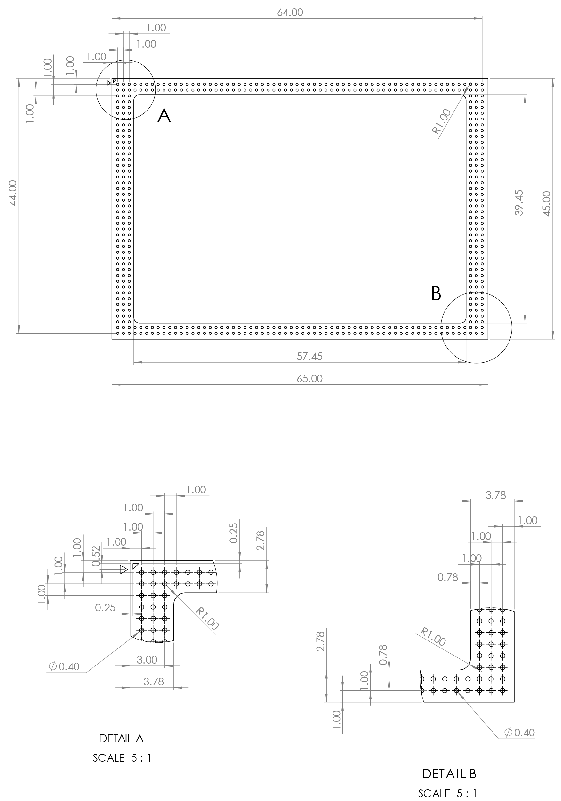
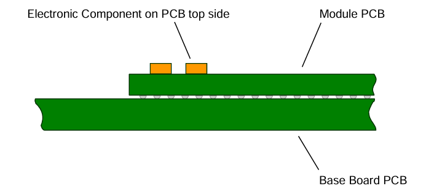
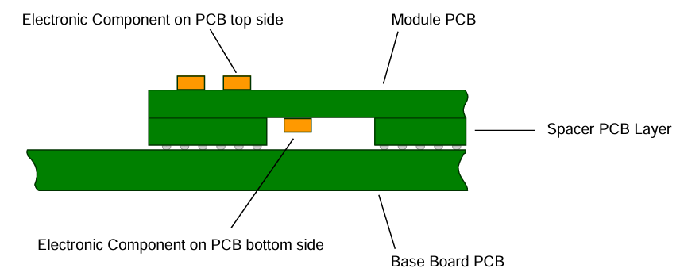
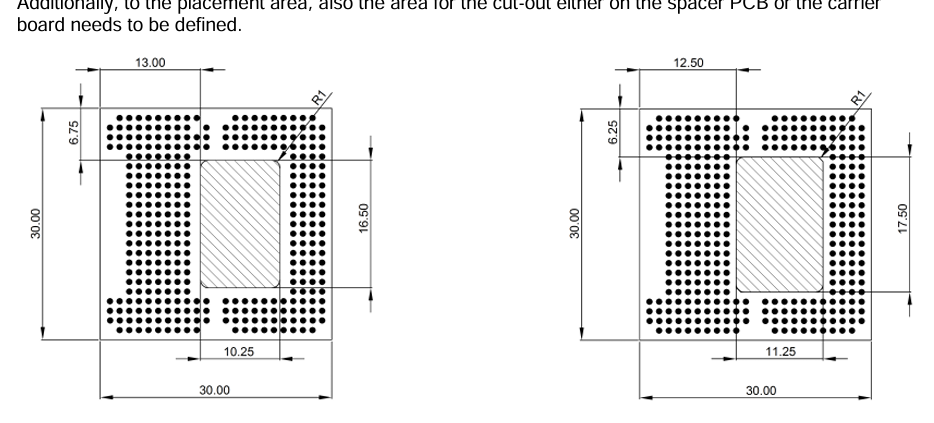

# E1M™ Specification — Edge-1 AI Module

**Designation:** E1M-STD-1.0
**Edition:** 1.0
**Date:** 2026 _(initial public release date pending)_
**Status:** Draft for review
**Publisher:** Alp Lab AB

**Reference implementation:** `pinout/v1.json` (E1M, 35 × 35 mm) and
`pinout/x-v1.json` (E1M-X, 45 × 65 mm) in this repository, validated by
`pinout/schema/loom-v1.schema.json`.

---

## Foreword

This specification is published by Alp Lab AB as an open standard for
small-form-factor, AI-capable, machine-processable Module-on-Module
(MoM) products. It is part of the **Open Standard Module™** family of
specifications.

The standard fixes the carrier-board pinout, mechanical envelope, and
electrical interface of two module form factors — **E1M** (35 × 35 mm)
and **E1M-X** (45 × 65 mm) — so that a single carrier board can host
modules built around different MCU, MPU, AI-accelerator, and memory
silicon, provided each module conforms to this specification.

Per-SoM design files (schematics, PCB layout, manufacturing data,
firmware) are **not** part of this specification. Each conformant SoM
publishes a per-SoM manifest declaring the routed subset of E1M pads
and the silicon behind those pads (see Annex C).

The pinout JSON files in this repository are mechanically generated
from the Altium pin-list exports kept under `source/`. The CI workflow
re-runs the generator on every push and rejects any commit that drifts
from the source.

This edition (1.0) is the first public release. Subsequent revisions
follow the versioning rules in §1.5.

---

## Introduction

E1M defines the universe of physical pads on a 35 × 35 mm or 45 × 65 mm
LGA SoM and which peripheral signals each pad may carry. The standard
is intentionally **silicon-agnostic**: it specifies pad-to-signal
assignments at the **default-function** level, and adds **GPIO** as a
universal secondary on every digital pad. Anything beyond the default
plus GPIO secondary — such as silicon-specific alternate functions — is
declared by the per-SoM manifest and falls outside E1M conformance.

The two form factors share the same family of signal classes; E1M-X
adds higher pad density to expose additional controllers (more PCIe
ports, more MIPI CSI lanes, parallel LCD, etc.) than fits on E1M.

---

## 1 Scope

### 1.1 What this specification covers

This specification defines, for the E1M and E1M-X form factors:

- The mechanical envelope (outline, height, component placement areas).
- The electrical interface (power input, voltage rails, reset, boot
  strap, electrical characteristics).
- The complete pinout (every pad's coordinate, default function, and
  the signal classes it may carry under the alternative-function
  policy in §8).
- The conformance criteria for SoMs and carrier boards (§9).
- The pinout JSON format (Loom v1) used to consume the standard
  programmatically (Annex B).

### 1.2 What this specification does not cover

- The internal design of any SoM (silicon, supporting components,
  software). These are SoM-vendor-specific and live outside this
  repository.
- Per-SoM peripheral mappings beyond the default and GPIO secondary
  functions. These live in per-SoM manifests (Annex C).
- Carrier-board reference designs.
- Marketing claims or feature endorsements.

### 1.3 Audience

- **SoM designers** producing E1M-conformant modules.
- **Carrier-board designers** producing baseboards, breakout boards,
  or end products that mount an E1M SoM.
- **Tooling authors** producing EDA libraries, schematic generators,
  or build systems that consume the pinout JSON.

### 1.4 Conventions

The keywords **MUST**, **MUST NOT**, **REQUIRED**, **SHALL**, **SHALL
NOT**, **SHOULD**, **SHOULD NOT**, **RECOMMENDED**, **MAY**, and
**OPTIONAL** in this document are to be interpreted as described in
[RFC 2119].

Throughout this document:

- Pad identifiers (e.g. `A1`, `K63`, `AQ15`) follow the BGA-style
  convention: column letter(s) followed by row number, in the
  coordinate space of the named form factor.
- Pin names in monospace (e.g. `I2C0_SCL`) match the `silkscreen`
  field of the corresponding pad in the pinout JSON.
- A value of *TBD* indicates a parameter intentionally not yet
  specified in this revision.

### 1.5 Versioning

The form-factor uses `major.minor` versioning:

- A **major** bump is required for any backwards-incompatible pad
  change — for example, removing a pad, narrowing the SignalKind set
  a pad may carry, or shifting a pad's coordinate.
- A **minor** bump is permitted for additions only — for example,
  populating a previously-reserved pad or adding an alt-function entry
  to an existing pad.

Released editions are tagged `v<major>.<minor>` in this repository
(e.g. `v1.0`).

---

## 2 Normative references

The following documents are referenced normatively. Where a dated
reference is given, only that revision applies. Where an undated
reference is given, the latest revision (including any amendments)
applies.

| Reference | Title |
| --- | --- |
| RFC 2119 | _Key words for use in RFCs to Indicate Requirement Levels_, S. Bradner, March 1997. |
| Loom format v1 | `pinout/schema/loom-v1.schema.json` in this repository. |

---

## 3 Terms, definitions, and abbreviations

### 3.1 Terms and definitions

- **carrier board** — Host PCB that mates with an E1M SoM via the LGA
  pad pattern defined in §5 and §7.
- **conformant** — Satisfying every **SHALL** clause in §9 for the
  applicable role (SoM or carrier board).
- **default function** — The single primary signal that an E1M pad
  **SHALL** carry on every conformant SoM that exposes that pad.
  Recorded in the `default` field of the pad's JSON entry and in the
  *Pin name* column of §7.3.
- **form factor** — One of the two mechanical envelopes defined in §4.
- **module / SoM (System-on-Module)** — Self-contained compute LGA
  module conforming to this specification.
- **pad** — Physical contact on the SoM's LGA package, identified by
  a BGA-style coordinate.
- **per-SoM manifest** — A separate, vendor-supplied document that
  declares which E1M pads a particular SoM routes and the silicon
  behind them (Annex C).

### 3.2 Abbreviations

| Term | Meaning |
| --- | --- |
| ADC | Analogue-to-digital converter |
| BGA | Ball-grid array (used here for the pad-numbering convention) |
| CAN | Controller area network |
| CSI | (MIPI) Camera Serial Interface |
| DAC | Digital-to-analogue converter |
| DSI | (MIPI) Display Serial Interface |
| ENC | Quadrature encoder |
| GPIO | General-purpose input / output |
| I²C, I³C | Inter-integrated circuit, version 2 / version 3 |
| I²S | Inter-IC sound |
| JTAG | Joint Test Action Group test interface |
| LCD | Liquid-crystal display (parallel RGB) |
| LGA | Land-grid array |
| LDO | Low-dropout regulator |
| MoM | Module-on-Module |
| NC | Not connected |
| OSM | Open Standard Module™ |
| PCIe | Peripheral Component Interconnect Express |
| PDM | Pulse-density modulation (microphone) |
| PMIC | Power-management IC |
| PWM | Pulse-width modulation |
| RSVD | Reserved for future use |
| SDIO | Secure-digital input/output |
| SoM | System-on-Module |
| SPI | Serial peripheral interface |
| SWD | (ARM) Serial-wire debug |
| TPM | Trusted Platform Module |
| UART | Universal asynchronous receiver-transmitter |
| WS | Word select (I²S frame strobe) |

---

## 4 Form factors

### 4.1 E1M ("Normal")

| Attribute | Value |
| --- | --- |
| Outline | **35 × 35 mm**, ±0.1 mm (TBD) |
| Pad pattern | LGA |
| Pad count | **312** |
| Coordinate space | Columns `A`–`AH`, rows `1`–`34` |
| Reference SoMs | ALP-AEN (Alif Ensemble) |

### 4.2 E1M-X ("Extended")

| Attribute | Value |
| --- | --- |
| Outline | **45 × 65 mm**, ±0.1 mm (TBD) |
| Pad pattern | LGA |
| Pad count | **496** |
| Coordinate space | Columns `A`–`AR`, rows `1`–`64` |
| Reference SoMs | ALP-X-V2N, ALP-X-V2N-M1 (Renesas RZ/V2N + DRP-AI3 + DeepX M1) |

### 4.3 Coordinate system

Each form factor uses an **independent** coordinate space. Pad `A1` on
E1M is **not** the same physical position as pad `A1` on E1M-X. SoM
manifests reference pads by `(form-factor id, coordinate)`. The
form-factor identifier `E1M` or `E1M-X` is recorded in the top-level
`id` field of the corresponding pinout JSON.

---

## 5 Mechanical requirements

### 5.1 Footprint

#### 5.1.1 E1M (35 × 35 mm)



*Figure 1 — E1M footprint (top view). Overall envelope 35.0 × 35.0 mm.
Central cavity 29.0 × 27.0 mm. Detail A (5:1 scale) shows the corner
pad band: 0.5 mm pitch, 0.4 mm pad diameter, 0.5 mm offset to the
package edge. Pin A1 corner is marked by the triangular fiducial.*

> **TODO (Alp Lab):** publish the full normative dimension callouts —
> tolerances on every dimension shown, solder-mask opening size, paste
> aperture, recommended carrier-board land pattern (per IPC-7351), and
> the matching Altium libraries.
> **Source:** Altium project (mechanical layers + footprint library).
> **Format:** Annex to this specification + an `altium/` directory in
> this repository containing the open-source footprint library.

#### 5.1.2 E1M-X (45 × 65 mm)



*Figure 2 — E1M-X footprint (top view). Overall envelope 45.0 × 65.0 mm.
Central cavity 39.45 × 57.45 mm. Two corner Detail views (5:1 scale)
show the pad band on the long and short edges. A scalable vector copy
is available in `images/e1m-x-footprint.svg`.*

> **TODO (Alp Lab):** publish the full normative dimension callouts and
> Altium library, as for §5.1.1.

### 5.2 Module height

Two height classes are defined. A SoM **SHALL** declare its height
class in its per-SoM manifest.

#### 5.2.1 Standard height



*Figure 3 — Standard-height cross-section. The SoM PCB sits directly
on the base-board surface; only the SoM's top-side components rise
above the base-board plane.*

> **TODO (Alp Lab):** specify the maximum module thickness measured
> from the underside of the SoM PCB to the highest top-side component,
> including any EMI shield. Specify the recommended LGA pad height /
> stand-off.
> **Format:** dimensioned mechanical drawing + numeric envelope (e.g.
> "≤ 2.5 mm above base-board top surface, including shield").

#### 5.2.2 Extended height



*Figure 4 — Extended-height cross-section. A spacer-PCB layer between
the SoM and the base board allows components on the bottom side of
the SoM to clear the base-board surface.*

> **TODO (Alp Lab):** specify the spacer-PCB thickness, the maximum
> total module thickness measured from base-board top surface to the
> highest top-side component, the maximum component height on the
> SoM bottom side, and the recommended cut-out / cavity in the
> base-board PCB or spacer.

### 5.3 Component placement areas



*Figure 5 — Component placement areas (top side, left; bottom side,
right). The hatched centre rectangle denotes the maximum-component-zone
within the LGA pad band; coordinates **TBD**.*

Where present, EMI shielding **SHALL** fit within the declared height
envelope.

> **TODO (Alp Lab):** publish numeric keepout dimensions for top and
> bottom placement zones for each form factor, the recommended cut-out
> in the base-board PCB or spacer, and any vendor-defined keepout for
> RF / antenna routing.
> **Format:** dimensioned drawing + table mapping zone → max component
> height for each form factor and height class.

### 5.4 Soldering

E1M and E1M-X **SHALL** be solderable to the carrier board using
LGA-class reflow soldering. Where a particular SoM is also compatible
with BGA-class reflow profiles, the per-SoM manifest **MAY** declare
this.

> **TODO (Alp Lab):** publish a recommended reflow profile (peak
> temperature, time above liquidus, ramp rates), paste-stencil
> thickness and aperture geometry, and rework / desoldering guidelines.
> **Source:** SoM characterisation lab data.
> **Format:** time-temperature curve + numeric table per IPC J-STD-020
> and J-STD-001.

### 5.5 Packaging

> **TODO (Alp Lab):** specify tape-and-reel pocket geometry, reel
> diameter, units per reel, MSL (moisture-sensitivity level) rating,
> dry-pack and shelf-life requirements, and tray dimensions for the
> tray alternative.
> **Source:** SoM manufacturing partner.
> **Format:** EIA-481-compliant tape-and-reel drawing + JEDEC-compliant
> tray drawing.

---

## 6 Electrical requirements

### 6.1 Power architecture

Conformant SoMs **SHALL** generate every internal supply rail on board
from a single externally-supplied 5 V input on the `VDD_5V_IN` pads
(see §7.3). On-module power management **SHALL** be performed by an
I²C-controlled PMIC.

A SoM **SHALL** expose a regulated 1.8 V I/O reference rail on the
`VIO_OUT` pads, sized to power any I/O level-shifting on the carrier
board.

> **TODO (Alp Lab):** specify the maximum sink current on `VIO_OUT`
> (per pad and aggregate), the regulation tolerance (e.g. 1.8 V ± 5%),
> and the over-current behaviour (current-limit, fold-back, or trip).
> **Format:** numeric values in §6.5's electrical-characteristics
> table.

A SoM **SHALL** include all decoupling capacitors required for
correct on-module operation. Carrier-board designers **SHOULD** add
additional decoupling capacitors close to high-current loads on the
carrier side.

### 6.2 Power sequencing

> **TODO (Alp Lab):** specify the power-up and power-down sequencing
> contract between the carrier board and the SoM:
> 1. Required ramp time on `VDD_5V_IN` (typical and worst-case).
> 2. Maximum allowed time from `VDD_5V_IN` valid → `VIO_OUT` valid.
> 3. `MODULE_EN` assertion timing relative to `VDD_5V_IN`.
> 4. `PORn` deassertion timing relative to `VIO_OUT` valid.
> 5. `MODULE_STBY` entry/exit timing.
> 6. Any forbidden sequences (e.g. carrier-board signals high while
>    `VDD_5V_IN` is low).
> **Format:** annotated waveform diagram + numeric timing table.

### 6.3 Reset and module enable

| Pad | Direction | Polarity | Description |
| --- | --- | --- | --- |
| `MODULE_EN` | input | active-high (default high via internal pull-up) | Drive low to disable the SoM. Open-drain. Carrier **MAY** leave floating if not used. |
| `MODULE_STBY` | input | active-low (TBD) | Module standby (low-power) request. Open-drain. TBD. |
| `PORn` | input | active-low (default high via internal pull-up to 1.8 V) | Power-on reset. Drive low to reset the SoM. Open-drain. Carrier **MAY** leave floating if not used. |

### 6.4 Boot configuration

E1M and E1M-X **SHALL** implement a four-pin boot strap on `BOOT0`,
`BOOT1`, `BOOT2`, and `BOOT3`. The interpretation of the strap is
silicon-specific and **SHALL** be declared in the per-SoM manifest.
The reference mapping below applies to the rev 1.0 reference SoMs
based on Renesas RZ/V2N (informative).

| BOOT1 | BOOT0 | Boot mode | Device | CA55 boot | CM33 boot |
| :---: | :---: | --- | --- | :---: | :---: |
| 0 | 0 | Mode 0 | eSD (3.3 V) | Supported | Not supported |
| 0 | 1 | Mode 1 | eMMC (1.8 V I/O) | Supported | Not supported |
| 1 | 0 | Mode 2 | QSPI NOR (1.8 V I/O) | Supported | Supported |
| 1 | 1 | Mode 3 | SCIF download | Supported | Supported |

`BOOT2` is fixed at `1` on the rev 1.0 reference SoMs; carrier boards
**SHALL** drive it according to the SoM manifest's declared default
or leave it as the SoM's internal pull defines. `BOOT3` selects the
boot CPU on the reference SoMs (high → CA55, low → CM33).

### 6.5 Electrical characteristics

> **TODO (Alp Lab):** publish four tables, each indexed by signal
> class:
>
> 1. **Absolute maximum ratings** — `VDD_5V_IN`, `VIO_OUT`, all signal
>    pads, ESD per HBM/CDM, junction temperature.
> 2. **Recommended operating conditions** — supply voltage range,
>    operating temperature range, humidity range.
> 3. **DC characteristics** — `V_IH`, `V_IL`, `V_OH`, `V_OL`, leakage,
>    pull-up / pull-down resistance, per pad class.
> 4. **AC characteristics** — slew rate, output drive strength, and
>    interface-specific timing (USB, MIPI, PCIe, etc.) where the
>    standard imposes timing beyond what the underlying interface
>    spec already mandates.
> **Source:** SoM characterisation lab data, derived from the silicon
> datasheets of conformant SoMs and validated on the SoM PCB.
> **Format:** four tables per §6.5.1–§6.5.4.

---

## 7 Pinout

### 7.1 Pin numbering convention

Pads on each form factor **SHALL** be identified using a BGA-style
coordinate of the form `<column-letter(s)><row-number>`:

- `A1` is the corner pad at column A, row 1, of the form factor's
  coordinate space.
- Letter columns increase as `A, B, …, Z, AA, AB, …, AH` for E1M and
  `A, B, …, Z, AA, AB, …, AR` for E1M-X.
- Row numbers increase from the top edge.

Each form factor uses its **own** coordinate space; the same physical
pad position has different coordinates on E1M and E1M-X. The
form-factor identifier `E1M` or `E1M-X` distinguishes the two.

### 7.2 Interface count overview

The following table summarises the count of each peripheral interface
exposed by this standard on each form factor.

| Feature | E1M | E1M-X |
| --- | :---: | :---: |
| Ethernet 1 GbE | 2 | 2 |
| USB 2.0 | 1 | 1 |
| USB 3.x | 1 | 2 |
| UART | 2 | 2 |
| SPI | 2 | 3 |
| I²C | 2 | 4 |
| I³C | 1 | 1 |
| I²S | 2 | 2 |
| SDIO / SD card (4-bit) | 1 | 1 |
| CAN-BUS | 1 | 2 |
| JTAG / SWD | 1 | 1 |
| GPIO (default-function) | 25 | 34 |
| PDM microphone | 2 | 2 |
| Audio master clock | 1 | 1 |
| RTC clock output | 1 | 1 |
| Boot-strap pins | 4 | 4 |
| Analogue input (ADC) | 8 | 8 |
| Analogue output (DAC) | 2 | 2 |
| Quadrature encoder | 4 | 4 |
| PWM | 8 | 8 |
| MIPI CSI-2 4-lane | 2 | 4 |
| MIPI DSI 4-lane | 2 | 2 |
| Parallel camera (8 / 16-bit) | 1 (8 bit) | 1 (16 bit) |
| Parallel LCD (24-bit RGB) | — | 1 |
| PCIe 4-lane | 1 | 2 |
| Reserved (RSVD) | 36 | 22 |
| Not connected (NC) | 0 | 35 |

> **Note.** The "GPIO (default-function)" row counts only pads whose
> default signal is `GPIO`. Per §8.2, every digital pad (USB, MIPI,
> ADC, etc.) **MAY** also be repurposed as `GPIO` on a conformant
> SoM; those repurposings are not counted here.

### 7.3 Pad assignments

Each subsection below is **normative** for the pad-to-signal mapping
listed. Pad coordinates are given for both form factors; an empty
column ("E1M only" or "E1M-X only") means the pad does not exist on
the other form factor. The pin name in the third column is the
silkscreen on the SoM and matches the `silkscreen` field of the
corresponding JSON pad. Where the silkscreen text differs between the
two form factors (because of historical naming choices in the Altium
project), both names are shown. Slash-combo names (`JTAG_TCK/SWDCLK`,
`CAN0H/CAN0_TX`) carry two equally-conformant primary functions; see
§8.3.

#### 7.3.1 Power & control

| E1M-X coord(s) | E1M coord(s) | Pin name |
| --- | --- | --- |
| AQ25 | AG15 | `+S_CAP` |
| H64 | Z34 | `+V_CAM0` |
| J64 | AB34 | `+V_CAM1` |
| L64 | _(E1M-X only)_ | `+V_CAM2` |
| N64 | _(E1M-X only)_ | `+V_CAM3` |
| AR9 | Z2 | `AUDIO_CLK` |
| B55 | A31 | `BL_LED_A` |
| A55 | B31 | `BL_LED_K` |
| Y2 | V2 | `BOOT0` |
| X2 | U2 | `BOOT1` |
| X1 | U1 | `BOOT2` |
| Y1 | V1 | `BOOT3` |
| H63 | Z33 | `CAM_VFB0` |
| J63 | AB33 | `CAM_VFB1` |
| L63 | _(E1M-X only)_ | `CAM_VFB2` |
| N63 | _(E1M-X only)_ | `CAM_VFB3` |
| 105 pads (see `pinout/x-v1.json`) | 46 pads (see `pinout/v1.json`) | `GND` |
| AA1 | O1 | `MODULE_EN` |
| AB1 | O2 | `MODULE_STBY` |
| Z1 | W1 | `PORn` |
| AQ16 | AH16 | `RTC_CLKOUT` |
| T1, T2, U1, U2, V1, V2 | R1, R2, S1, S2 | `VDD_5V_IN` (E1M-X) / `VDD` (E1M) |
| W1, W2 | P1, P2 | `VIO_OUT` |

The complete `GND` pad list is enumerated in `pinout/v1.json` (E1M)
and `pinout/x-v1.json` (E1M-X). Carrier boards **SHALL** connect
every `GND` pad on the SoM to a low-impedance ground plane.

#### 7.3.2 Antenna

A conformant SoM **MAY** populate any subset of the antenna outputs.
Pads not driven by RF on a particular SoM **SHALL** be left as
no-connect by the carrier board. Where used, the carrier-board trace
**SHALL** be 50 Ω characteristic impedance.

| E1M-X coord(s) | E1M coord(s) | Pin name |
| --- | --- | --- |
| AR1 | AH1 | `ANT_2.4GHz` (E1M-X) / `ANT_2.4GHZ` (E1M) |
| AP1 | AF1 | `ANT_5GHz` (E1M-X) / `ANT_5GHZ` (E1M) |
| AN1 | AD1 | `ANT_6GHz` (E1M-X) / `ANT_6GHZ` (E1M) |

#### 7.3.3 Reserved (RSVD)

Reserved pads are reserved for manufacturing or future expansion.
Carrier boards **SHALL** leave them unconnected.

| E1M-X coord(s) | E1M coord(s) | Pin name |
| --- | --- | --- |
| W62, X62, Y62, Z62, AA62, AB62, AC62, AD62, AE62, AF62, AG62, AH62, AI62, AJ62, AK62, AL62, AM62, AN62, AO62, AP62, AQ62, AR62 | A33, A34, D32, E32, F32, G32, H32, I32, J32, K32, L32, M32, N32, O32, P32, Q3, Q32, R3, R32, S3, T3, U3, V3, W3, X3, Y3, Z3, AA3, AB3, AC3, AD3, AE3, AG26, AG32, AH26, AH32 | `RSVD` |

#### 7.3.4 Not connected (NC)

NC pads have no internal connection. Carrier boards **MAY** route
through them or leave them unconnected.

| E1M-X coord(s) | E1M coord(s) | Pin name |
| --- | --- | --- |
| D63, AD3, AE3, AF3, AG3, AH3, AI3, AJ3, AK3, AL3, AM3, AN3, AO3, AP3, AQ36–AQ45, AR36–AR45 | _(none)_ | `NC` |

#### 7.3.5 USB

E1M provides one USB 2.0 and one USB 3.x interface. E1M-X provides
one USB 2.0 and two USB 3.x interfaces.

| E1M-X coord(s) | E1M coord(s) | Pin name |
| --- | --- | --- |
| C1 | C1 | `USB0_30_D_N` |
| B1 | B1 | `USB0_30_D_P` |
| D2 | D2 | `USB0_30_ID` |
| F1 | E1 | `USB0_30_RX0_N` |
| E1 | D1 | `USB0_30_RX0_P` |
| I1 | G1 | `USB0_30_TX0_N` |
| H1 | F1 | `USB0_30_TX0_P` |
| C2 | C2 | `USB0_30_VBUS` (E1M-X) / `USB0_VBUS` (E1M) |
| L1 | _(E1M-X only)_ | `USB1_30_D_N` |
| K1 | _(E1M-X only)_ | `USB1_30_D_P` |
| R2 | _(E1M-X only)_ | `USB1_30_ID` |
| O1 | _(E1M-X only)_ | `USB1_30_RX0_N` |
| N1 | _(E1M-X only)_ | `USB1_30_RX0_P` |
| R1 | _(E1M-X only)_ | `USB1_30_TX0_N` |
| Q1 | _(E1M-X only)_ | `USB1_30_TX0_P` |
| Q2 | _(E1M-X only)_ | `USB1_30_VBUS` |
| J2 | J1 | `USB2_20_N` (E1M-X) / `USB2_N` (E1M) |
| I2 | I1 | `USB2_20_P` (E1M-X) / `USB2_P` (E1M) |
| G2 | J2 | `USB2_20_ID` (E1M-X) / `USB2_ID` (E1M) |
| F2 | I2 | `USB2_20_VBUS` (E1M-X) / `USB2_VBUS` (E1M) |
| A2 | A2 | `USB_CC1` |
| B2 | B2 | `USB_CC2` |

#### 7.3.6 Ethernet

E1M and E1M-X each provide two 1 GbE PHYs. Differential pairs **SHALL**
include EMI and ESD protection on the SoM; carrier boards **SHALL**
provide a magnetic transformer (or transformer-integrated connector).

| E1M-X coord(s) | E1M coord(s) | Pin name |
| --- | --- | --- |
| AR56 | AH30 | `ETH0_DA_N` |
| AQ56 | AG30 | `ETH0_DA_P` |
| AR57 | AH29 | `ETH0_DB_N` |
| AQ57 | AG29 | `ETH0_DB_P` |
| AR58 | AH28 | `ETH0_DC_N` |
| AQ58 | AG28 | `ETH0_DC_P` |
| AR59 | AH27 | `ETH0_DD_N` |
| AQ59 | AG27 | `ETH0_DD_P` |
| AQ60 | AG31 | `ETH0_LED0` |
| AR60 | AH31 | `ETH0_LED1` |
| AR49 | AH23 | `ETH1_DA_N` |
| AQ49 | AG23 | `ETH1_DA_P` |
| AR50 | AH22 | `ETH1_DB_N` |
| AQ50 | AG22 | `ETH1_DB_P` |
| AR51 | AH21 | `ETH1_DC_N` |
| AQ51 | AG21 | `ETH1_DC_P` |
| AR52 | AH20 | `ETH1_DD_N` |
| AQ52 | AG20 | `ETH1_DD_P` |
| AQ53 | AG24 | `ETH1_LED0` |
| AR53 | AH24 | `ETH1_LED1` |

#### 7.3.7 PCIe

E1M provides one ×4 PCIe controller; E1M-X provides two.

| E1M-X coord(s) | E1M coord(s) | Pin name |
| --- | --- | --- |
| B47 | B29 | `PCIE0_CLK_N` |
| A47 | A29 | `PCIE0_CLK_P` |
| B42 | B25 | `PCIE0_RX0_N` |
| A42 | A25 | `PCIE0_RX0_P` |
| B43 | B26 | `PCIE0_RX1_N` |
| A43 | A26 | `PCIE0_RX1_P` |
| B44 | B27 | `PCIE0_RX2_N` |
| A44 | A27 | `PCIE0_RX2_P` |
| B45 | B28 | `PCIE0_RX3_N` |
| A45 | A28 | `PCIE0_RX3_P` |
| B38 | B21 | `PCIE0_TX0_N` |
| A38 | A21 | `PCIE0_TX0_P` |
| B39 | B22 | `PCIE0_TX1_N` |
| A39 | A22 | `PCIE0_TX1_P` |
| B40 | B23 | `PCIE0_TX2_N` |
| A40 | A23 | `PCIE0_TX2_P` |
| B41 | B24 | `PCIE0_TX3_N` |
| A41 | A24 | `PCIE0_TX3_P` |
| B36 | _(E1M-X only)_ | `PCIE1_CLK_N` |
| A36 | _(E1M-X only)_ | `PCIE1_CLK_P` |
| B31 | _(E1M-X only)_ | `PCIE1_RX0_N` |
| A31 | _(E1M-X only)_ | `PCIE1_RX0_P` |
| B32 | _(E1M-X only)_ | `PCIE1_RX1_N` |
| A32 | _(E1M-X only)_ | `PCIE1_RX1_P` |
| B33 | _(E1M-X only)_ | `PCIE1_RX2_N` |
| A33 | _(E1M-X only)_ | `PCIE1_RX2_P` |
| B34 | _(E1M-X only)_ | `PCIE1_RX3_N` |
| A34 | _(E1M-X only)_ | `PCIE1_RX3_P` |
| B27 | _(E1M-X only)_ | `PCIE1_TX0_N` |
| A27 | _(E1M-X only)_ | `PCIE1_TX0_P` |
| B28 | _(E1M-X only)_ | `PCIE1_TX1_N` |
| A28 | _(E1M-X only)_ | `PCIE1_TX1_P` |
| B29 | _(E1M-X only)_ | `PCIE1_TX2_N` |
| A29 | _(E1M-X only)_ | `PCIE1_TX2_P` |
| B30 | _(E1M-X only)_ | `PCIE1_TX3_N` |
| A30 | _(E1M-X only)_ | `PCIE1_TX3_P` |

#### 7.3.8 I²C

| E1M-X coord(s) | E1M coord(s) | Pin name |
| --- | --- | --- |
| AH1 | AE2 | `I2C0_SCL` |
| AH2 | AD2 | `I2C0_SDA` |
| AQ47 | AG17 | `I2C1_SCL` |
| AR47 | AH17 | `I2C1_SDA` |
| E64 | _(E1M-X only)_ | `I2C2_SCL` |
| E63 | _(E1M-X only)_ | `I2C2_SDA` |
| A24 | _(E1M-X only)_ | `I2C3_SCL` |
| A23 | _(E1M-X only)_ | `I2C3_SDA` |

#### 7.3.9 I³C

| E1M-X coord(s) | E1M coord(s) | Pin name |
| --- | --- | --- |
| AQ19 | AG5 | `I3C_SCL` |
| AR19 | AH5 | `I3C_SDA` |

#### 7.3.10 UART

This revision specifies only the data lines (TX/RX) of each UART.
Carrier-board flow control via RTS/CTS is permitted via the
silicon-specific alt-function policy (§8.4) but is not part of
default-function conformance.

| E1M-X coord(s) | E1M coord(s) | Pin name |
| --- | --- | --- |
| AB2 | G2 | `UART0_RX` |
| AA2 | F2 | `UART0_TX` |
| AR17 | AH4 | `UART1_RX` |
| AQ17 | AG4 | `UART1_TX` |

#### 7.3.11 SPI

| E1M-X coord(s) | E1M coord(s) | Pin name |
| --- | --- | --- |
| AE1 | M1 | `SPI0_CS0` |
| AF1 | N1 | `SPI0_CS1` |
| AD1 | L1 | `SPI0_MISO` |
| AD2 | M2 | `SPI0_MOSI` |
| AE2 | N2 | `SPI0_SCLK` |
| AR14 | AH9 | `SPI1_CS0` |
| AR13 | AH8 | `SPI1_CS1` |
| AQ13 | AG8 | `SPI1_MISO` |
| AQ14 | AG9 | `SPI1_MOSI` |
| AR15 | AG10 | `SPI1_SCLK` |
| C64 | _(E1M-X only)_ | `SPI2_CS0` |
| D64 | _(E1M-X only)_ | `SPI2_CS1` |
| B63 | _(E1M-X only)_ | `SPI2_MISO` |
| B64 | _(E1M-X only)_ | `SPI2_MOSI` |
| C63 | _(E1M-X only)_ | `SPI2_SCLK` |

#### 7.3.12 I²S

| E1M-X coord(s) | E1M coord(s) | Pin name |
| --- | --- | --- |
| AQ5 | AE33 | `I2S0_SCLK` |
| AQ4 | AD33 | `I2S0_SDI` |
| AR4 | AD34 | `I2S0_SDO` |
| AR5 | AE34 | `I2S0_WS` |
| AR11 | AH7 | `I2S1_SCLK` |
| AR10 | AH6 | `I2S1_SDI` |
| AQ10 | AG6 | `I2S1_SDO` |
| AQ11 | AG7 | `I2S1_WS` |

#### 7.3.13 SWD / JTAG

Two pads carry **compound** primary functions; either name in the
slash combo is conformant. Selection is a carrier-board decision (§8.3).

| E1M-X coord(s) | E1M coord(s) | Pin name |
| --- | --- | --- |
| AJ1 | X1 | `JTAG_TCK/SWDCLK` |
| AJ2 | X2 | `JTAG_TDI` |
| AK2 | Y2 | `JTAG_TDO` |
| AK1 | Y1 | `JTAG_TMS/SWDIO` |
| AL1 | Z1 | `JTAG_nRST` |

#### 7.3.14 CAN bus

Each CAN controller's bus pads carry compound primary functions
(`CANxH/CANx_TX`, `CANxL/CANx_RX`). The first form (`H`/`L`) is the
controller-side connection to an external CAN transceiver; the second
form (`TX`/`RX`) is the digital-controller form that an integrated
on-SoC transceiver consumes.

| E1M-X coord(s) | E1M coord(s) | Pin name |
| --- | --- | --- |
| B21 | B18 | `CAN0H/CAN0_TX` |
| B22 | B19 | `CAN0L/CAN0_RX` |
| B24 | _(E1M-X only)_ | `CAN1H/CAN1_TX` |
| B25 | _(E1M-X only)_ | `CAN1L/CAN1_RX` |
| A21 | A19 | `CAN_STBY` |

#### 7.3.15 SDIO / SD card

| E1M-X coord(s) | E1M coord(s) | Pin name |
| --- | --- | --- |
| AQ31 | AG11 | `SD_CLK` |
| AR31 | AH11 | `SD_CMD` |
| AQ32 | AG12 | `SD_D0` |
| AR33 | AH13 | `SD_D1` |
| AQ33 | AG13 | `SD_D2` |
| AR34 | AH14 | `SD_D3` |
| AQ34 | AG14 | `SD_DET` |
| AR32 | AH12 | `SD_RST` |
| AQ30 | AH10 | `SD_VDD_OUT` (E1M-X) / `SD_VDD` (E1M) |

#### 7.3.16 MIPI DSI display

E1M and E1M-X each provide two 4-lane MIPI DSI interfaces (DSI0,
DSI1). Backlight control pads are listed in §7.3.1.

| E1M-X coord(s) | E1M coord(s) | Pin name |
| --- | --- | --- |
| B61 | F34 | `DSI0_0_N` |
| A61 | F33 | `DSI0_0_P` |
| B60 | E34 | `DSI0_1_N` |
| A60 | E33 | `DSI0_1_P` |
| B59 | C34 | `DSI0_2_N` |
| A59 | C33 | `DSI0_2_P` |
| B58 | B34 | `DSI0_3_N` |
| A58 | B33 | `DSI0_3_P` |
| B57 | D34 | `DSI0_C_N` |
| A57 | D33 | `DSI0_C_P` |
| B53 | L34 | `DSI1_0_N` |
| A53 | L33 | `DSI1_0_P` |
| B52 | K34 | `DSI1_1_N` |
| A52 | K33 | `DSI1_1_P` |
| B51 | I34 | `DSI1_2_N` |
| A51 | I33 | `DSI1_2_P` |
| B50 | H34 | `DSI1_3_N` |
| A50 | H33 | `DSI1_3_P` |
| B49 | J34 | `DSI1_C_N` |
| A49 | J33 | `DSI1_C_P` |

#### 7.3.17 MIPI CSI camera

E1M provides two 4-lane MIPI CSI-2 interfaces; E1M-X provides four.
Per-camera LDO outputs (`+V_CAM*`, `CAM_VFB*`) are listed in §7.3.1.

| E1M-X coord(s) | E1M coord(s) | Pin name |
| --- | --- | --- |
| T64 | R34 | `CSI0_0_N` |
| T63 | R33 | `CSI0_0_P` |
| S64 | Q34 | `CSI0_1_N` |
| S63 | Q33 | `CSI0_1_P` |
| Q64 | O34 | `CSI0_2_N` |
| Q63 | O33 | `CSI0_2_P` |
| P64 | N34 | `CSI0_3_N` |
| P63 | N33 | `CSI0_3_P` |
| R64 | P34 | `CSI0_C_N` |
| R63 | P33 | `CSI0_C_P` |
| Z64 | X34 | `CSI1_0_N` |
| Z63 | X33 | `CSI1_0_P` |
| Y64 | W34 | `CSI1_1_N` |
| Y63 | W33 | `CSI1_1_P` |
| W64 | U34 | `CSI1_2_N` |
| W63 | U33 | `CSI1_2_P` |
| V64 | T34 | `CSI1_3_N` |
| V63 | T33 | `CSI1_3_P` |
| X64 | V34 | `CSI1_C_N` |
| X63 | V33 | `CSI1_C_P` |
| AF64 | _(E1M-X only)_ | `CSI2_0_N` |
| AF63 | _(E1M-X only)_ | `CSI2_0_P` |
| AE64 | _(E1M-X only)_ | `CSI2_1_N` |
| AE63 | _(E1M-X only)_ | `CSI2_1_P` |
| AC64 | _(E1M-X only)_ | `CSI2_2_N` |
| AC63 | _(E1M-X only)_ | `CSI2_2_P` |
| AB64 | _(E1M-X only)_ | `CSI2_3_N` |
| AB63 | _(E1M-X only)_ | `CSI2_3_P` |
| AD64 | _(E1M-X only)_ | `CSI2_C_N` |
| AD63 | _(E1M-X only)_ | `CSI2_C_P` |
| AL64 | _(E1M-X only)_ | `CSI3_0_N` |
| AL63 | _(E1M-X only)_ | `CSI3_0_P` |
| AK64 | _(E1M-X only)_ | `CSI3_1_N` |
| AK63 | _(E1M-X only)_ | `CSI3_1_P` |
| AI64 | _(E1M-X only)_ | `CSI3_2_N` |
| AI63 | _(E1M-X only)_ | `CSI3_2_P` |
| AH64 | _(E1M-X only)_ | `CSI3_3_N` |
| AH63 | _(E1M-X only)_ | `CSI3_3_P` |
| AJ64 | _(E1M-X only)_ | `CSI3_C_N` |
| AJ63 | _(E1M-X only)_ | `CSI3_C_P` |

#### 7.3.18 Parallel camera

E1M exposes 8 parallel-camera data lines (`CAM_D1`–`CAM_D8`). E1M-X
exposes 16 (`CAM_D1`–`CAM_D16`).

| E1M-X coord(s) | E1M coord(s) | Pin name |
| --- | --- | --- |
| G62 | W32 | `CAM_D1` |
| H62 | X32 | `CAM_D2` |
| I62 | Y32 | `CAM_D3` |
| J62 | Z32 | `CAM_D4` |
| K62 | AA32 | `CAM_D5` |
| L62 | AB32 | `CAM_D6` |
| M62 | AC32 | `CAM_D7` |
| N62 | AD32 | `CAM_D8` |
| O62 | _(E1M-X only)_ | `CAM_D9` |
| P62 | _(E1M-X only)_ | `CAM_D10` |
| Q62 | _(E1M-X only)_ | `CAM_D11` |
| R62 | _(E1M-X only)_ | `CAM_D12` |
| S62 | _(E1M-X only)_ | `CAM_D13` |
| T62 | _(E1M-X only)_ | `CAM_D14` |
| U62 | _(E1M-X only)_ | `CAM_D15` |
| V62 | _(E1M-X only)_ | `CAM_D16` |
| C62 | T32 | `CAM_HSYNC` |
| E62 | V32 | `CAM_PCLK` |
| D62 | S32 | `CAM_VSYNC` |
| F62 | U32 | `CAM_XVCLK` |

#### 7.3.19 LCD parallel display

E1M-X exposes a 24-bit RGB parallel LCD interface plus H/V sync.
This interface is not present on E1M.

| E1M-X coord(s) | E1M coord(s) | Pin name |
| --- | --- | --- |
| D3 | _(E1M-X only)_ | `LCD_B0` |
| E3 | _(E1M-X only)_ | `LCD_B1` |
| F3 | _(E1M-X only)_ | `LCD_B2` |
| G3 | _(E1M-X only)_ | `LCD_B3` |
| H3 | _(E1M-X only)_ | `LCD_B4` |
| I3 | _(E1M-X only)_ | `LCD_B5` |
| J3 | _(E1M-X only)_ | `LCD_B6` |
| K3 | _(E1M-X only)_ | `LCD_B7` |
| L3 | _(E1M-X only)_ | `LCD_B8` |
| M3 | _(E1M-X only)_ | `LCD_B9` |
| N3 | _(E1M-X only)_ | `LCD_B10` |
| O3 | _(E1M-X only)_ | `LCD_B11` |
| P3 | _(E1M-X only)_ | `LCD_B12` |
| Q3 | _(E1M-X only)_ | `LCD_B13` |
| R3 | _(E1M-X only)_ | `LCD_B14` |
| S3 | _(E1M-X only)_ | `LCD_B15` |
| T3 | _(E1M-X only)_ | `LCD_B16` |
| U3 | _(E1M-X only)_ | `LCD_B17` |
| V3 | _(E1M-X only)_ | `LCD_B18` |
| W3 | _(E1M-X only)_ | `LCD_B19` |
| X3 | _(E1M-X only)_ | `LCD_B20` |
| Y3 | _(E1M-X only)_ | `LCD_B21` |
| Z3 | _(E1M-X only)_ | `LCD_B22` |
| AA3 | _(E1M-X only)_ | `LCD_B23` |
| AB3 | _(E1M-X only)_ | `LCD_HSYNC` |
| AC3 | _(E1M-X only)_ | `LCD_VSYNC` |

#### 7.3.20 PDM microphone

| E1M-X coord(s) | E1M coord(s) | Pin name |
| --- | --- | --- |
| AQ7 | AA1 | `PDM_C0` |
| AQ8 | AB1 | `PDM_C1` |
| AR7 | AA2 | `PDM_D0` |
| AR8 | AB2 | `PDM_D1` |

#### 7.3.21 Analogue inputs (ADC)

| E1M-X coord(s) | E1M coord(s) | Pin name |
| --- | --- | --- |
| A17 | A15 | `ANA_S0` |
| B17 | B15 | `ANA_S1` |
| A16 | A14 | `ANA_S2` |
| B16 | B14 | `ANA_S3` |
| A15 | A13 | `ANA_S4` |
| B15 | B13 | `ANA_S5` |
| A14 | A12 | `ANA_S6` |
| B14 | B12 | `ANA_S7` |

#### 7.3.22 Analogue outputs (DAC)

| E1M-X coord(s) | E1M coord(s) | Pin name |
| --- | --- | --- |
| A19 | A16 | `DAC0` |
| B19 | B16 | `DAC1` |

#### 7.3.23 Quadrature encoder

| E1M-X coord(s) | E1M coord(s) | Pin name |
| --- | --- | --- |
| A12 | A10 | `ENC0_X` |
| B12 | B10 | `ENC0_Y` |
| A11 | A9 | `ENC1_X` |
| B11 | B9 | `ENC1_Y` |
| A10 | A8 | `ENC2_X` |
| B10 | B8 | `ENC2_Y` |
| A9 | A7 | `ENC3_X` |
| B9 | B7 | `ENC3_Y` |

#### 7.3.24 PWM

| E1M-X coord(s) | E1M coord(s) | Pin name |
| --- | --- | --- |
| A7 | A6 | `PWM0` |
| B7 | B6 | `PWM1` |
| A6 | A5 | `PWM2` |
| B6 | B5 | `PWM3` |
| A5 | A4 | `PWM4` |
| B5 | B4 | `PWM5` |
| A4 | A3 | `PWM6` |
| B4 | B3 | `PWM7` |

#### 7.3.25 GPIO

The pads listed below have `GPIO` as their **default** function. Per
§8.2, every other digital pad **MAY** also be repurposed as `GPIO`
(secondary), but those are not enumerated here.

| E1M-X coord(s) | E1M coord(s) | Pin name |
| --- | --- | --- |
| L2 | L2 | `IO0` |
| M2 | _(E1M-X only)_ | `IO1` |
| N2 | W2 | `IO2` |
| O2 | AG2 | `IO3` |
| AF2 | AG16 | `IO4` |
| AG2 | AH18 | `IO5` |
| AL2 | AG18 | `IO6` |
| _(E1M only)_ | AG34 | `IO7` |
| AR21 | AG33 | `IO8` |
| AQ21 | AH34 | `IO9` |
| AR22 | AH33 | `IO10` |
| AQ22 | A18 | `IO11` |
| AR23 | _(E1M-X only)_ | `IO12` |
| AQ23 | E3 | `IO13` |
| AR24 | _(E1M-X only)_ | `IO14` |
| AQ24 | F3 | `IO15` |
| AR25 | G3 | `IO16` |
| AQ26 | H3 | `IO17` |
| AR26 | I3 | `IO18` |
| AQ27 | J3 | `IO19` |
| AR27 | K3 | `IO20` |
| AQ28 | L3 | `IO21` |
| AR28 | M3 | `IO22` |
| _(E1M only)_ | N3 | `IO23` |
| AR29 | O3 | `IO24` |
| F63 | P3 | `IO25` |
| F64 | _(E1M-X only)_ | `IO26` |
| AN63 | _(E1M-X only)_ | `IO27` |
| AN64 | _(E1M-X only)_ | `IO28` |
| AO63 | _(E1M-X only)_ | `IO29` |
| AO64 | _(E1M-X only)_ | `IO30` |
| AP63 | _(E1M-X only)_ | `IO31` |
| AP64 | _(E1M-X only)_ | `IO32` |
| AQ63 | _(E1M-X only)_ | `IO33` |
| AQ64 | _(E1M-X only)_ | `IO34` |
| A25 | _(E1M-X only)_ | `IO35` |

---

## 8 Alternative-function policy

### 8.1 Default function

Every E1M pad has exactly one **default** primary function fixed by
this specification. The default function **SHALL** match the `default`
field of the corresponding pad in `pinout/v1.json` or `pinout/x-v1.json`,
which in turn matches the *Pin name* column of §7.3.

Conformant SoMs **SHALL** route the default function to the named pad
on every pad they expose. SoMs **MAY** leave any pad unconnected; an
unconnected pad **SHALL NOT** appear in the per-SoM manifest's `routes`
list (it **MAY** appear in `not_routed`).

### 8.2 GPIO secondary

For any pad whose default function is a digital signal — that is,
**not** in the set { `GND`, `NC`, `RSVD`, `POWER_*`, `ANT_*`,
`BL_LED_A`, `BL_LED_K` } — a conformant SoM **MAY** additionally expose
the pad as a general-purpose digital I/O (`GPIO`).

A carrier board that uses a pad as GPIO **SHALL** remain
hardware-compatible with any conformant SoM that routes only the
default function on that pad, provided the carrier board treats the
pad as default-driven when no GPIO software is loaded.

In the JSON, the GPIO secondary is expressed by including
`{ "signal": "GPIO" }` in the pad's `alt` array.

### 8.3 Compound-function pins

Some pads carry **two** equally-conformant primary functions. The
silkscreen for such a pad uses a slash to combine the two names. The
JSON encodes the first name as `default` and the second name as the
first entry of `alt`, ahead of the GPIO secondary. Compound pins
present in this revision:

- `JTAG_TCK/SWDCLK`, `JTAG_TMS/SWDIO`
- `CAN0H/CAN0_TX`, `CAN0L/CAN0_RX`, `CAN1H/CAN1_TX`, `CAN1L/CAN1_RX`

Carrier boards **MAY** select either function; selection is a
per-board decision. Both functions are conformant.

### 8.4 Per-SoM tertiary functions

Functions beyond the default and the GPIO secondary (and, where
applicable, the second name of a compound pin) are silicon-specific.
Such tertiary functions **SHALL NOT** be assumed by carrier boards
that target the standard generically. A carrier board that requires a
tertiary function **SHALL** declare a per-SoM dependency in its build
system and reject any SoM whose manifest does not expose that
function.

The set of tertiary functions a SoM exposes **SHALL** be declared in
its per-SoM manifest (Annex C).

### 8.5 Peripheral-instance naming

Where a pad belongs to a multi-instance peripheral (multiple I²C
controllers, multiple PCIe controllers, etc.), the JSON pad records
the instance in its `instance` field. Instance names **MUST** match
the pattern:

```
^(I2C|I3C|SPI|UART|I2S|CSI|DSI|LCD|PWM|ADC|DAC|USB|ETH|PCIE|CAN|SDIO|JTAG|PDM|ENC|PARCAM|BL|CAM|BOOT)\d*$
```

Pads without a peripheral context (e.g. `GND`, `VDD_5V_IN`, antenna
outputs) **MAY** omit the `instance` field.

---

## 9 Conformance

### 9.1 SoM conformance

A System-on-Module is **E1M-conformant** if and only if every clause
below is satisfied for the form factor it declares (E1M or E1M-X):

1. **Mechanical.** The outline matches the form-factor envelope per §4
   and §5, within the tolerances specified.
2. **Pinout.** For every pad the SoM routes, the pad's BGA coordinate
   and `default` signal class match the corresponding entry in
   `pinout/v1.json` (E1M) or `pinout/x-v1.json` (E1M-X). The SoM
   **MAY** leave any pad as no-connect.
3. **Electrical.** The SoM meets the absolute maximum ratings and
   recommended operating conditions of §6 (TBD in this revision).
4. **Boot.** The SoM implements a boot strap on `BOOT0`–`BOOT3` per
   §6.4. The per-SoM manifest declares the strap mapping; the strap
   pad locations **SHALL** match §7.3.1.
5. **Manifest.** The SoM publishes a per-SoM manifest conforming to
   the format in Annex C.

### 9.2 Carrier-board conformance

A carrier board is **E1M-conformant** if all of the following hold:

1. The mating land pattern, power delivery, and pad-by-pad signal
   usage match the chosen form factor's coordinate space.
2. The carrier does not require any tertiary function (§8.4) unless
   it explicitly targets a single SoM or set of SoMs (declared in
   the carrier's BOM / build system).
3. The carrier connects every `GND` pad of the SoM to a low-impedance
   ground plane.

### 9.3 Optional vs. mandatory pad classes

This revision does not partition pads into mandatory vs. optional
classes. A future minor release **SHOULD** define:

- **Mandatory pads** — `GND`, `VDD_5V_IN`, `MODULE_EN`, `PORn`,
  `BOOT0`–`BOOT3`, `JTAG_*`.
- **Optional pads** — All other interface pads.

Until that partitioning is published, conformant SoMs **MAY** omit
any non-power, non-reserved, non-debug pad without losing conformance.

---

## 10 Trademarks, licensing, and intellectual property

### 10.1 Trademarks

"E1M™", "Edge-1 AI Module™", and "Open Standard Module™" are
trademarks of Alp Lab AB. Products that conform to this specification
**MAY NOT** use these trademarks without separate written permission
from Alp Lab AB. Implementations **MAY** truthfully describe themselves
as "E1M-compatible" or "implementing the E1M v1.0 specification"
without using the trademarks.

### 10.2 Licensing of this specification

This specification (the prose, the pinout JSONs, the JSON Schema, the
example manifests, and the Altium pin-list exports under `source/`)
is licensed under the
[Creative Commons Attribution-ShareAlike 4.0 International License][CC-BY-SA-4.0]
(CC BY-SA 4.0). See `LICENSE` for the full notice.

### 10.3 What is **not** licensed under CC BY-SA 4.0

The proprietary System-on-Module designs that implement this
specification — including but not limited to ALP-AEN, ALP-X-V2N,
ALP-X-V2N-M1, their schematics, PCB layouts, Altium libraries, BOMs,
manufacturing files, firmware, and software — are **not** part of this
repository and are **not** licensed under CC BY-SA 4.0. Those
artefacts are proprietary to Alp Lab AB and require a separate written
agreement.

### 10.4 Disclaimers

Alp Lab AB provides this specification "AS IS" and disclaims all
warranties of merchantability or fitness for any particular purpose.
Compliance with this specification does not absolve manufacturers
from the requirements of safety and regulatory agencies (EN, UL, CSA,
FCC, IEC, etc.). All content and information within this document are
subject to change without prior notice.

[RFC 2119]: https://www.rfc-editor.org/rfc/rfc2119
[CC-BY-SA-4.0]: https://creativecommons.org/licenses/by-sa/4.0/legalcode

---

## Annex A (informative) — Reference SoM constructions

This annex describes on-module components used by the rev 1.0 reference
SoMs. The information is **informative**; conformant SoMs **MAY** use
any component set that satisfies §4–§9.

| Reference SoM | Form factor | Primary silicon | Notes |
| --- | --- | --- | --- |
| **ALP-AEN** | E1M | Alif Semiconductor Ensemble E3 | Bring-up SoM. Subset routing focused on debug + I²C + GPIO. |
| **ALP-X-V2N** | E1M-X | Renesas RZ/V2N (CA55 + CM33 + DRP-AI3) | Full-feature SoM without companion accelerator. |
| **ALP-X-V2N-M1** | E1M-X | Renesas RZ/V2N + DeepX DX-M1 | Full-feature SoM with PCIe-attached NPU companion. |

### A.1 Wireless module & antenna

E1M-X may carry a Wi-Fi 6 + BLE 5.4 combo module together with an
optional U.FL connector for an external antenna. The antenna may also
be routed off-module to a carrier-side antenna. The antenna selection
is a per-SoM choice.

### A.2 Memories

The reference E1M-X SoMs support:

- **eMMC** up to 256 GB.
- **LPDDR4X** up to 8 GB.
- **NOR Flash** with boot support.
- **EEPROM** for board-ID / configuration storage.

### A.3 Trusted Platform Module

The rev 1.0 reference E1M-X SoMs include one Trusted Platform Module
(TPM 2.0).

### A.4 Real-Time Clock

E1M and E1M-X SoMs may include a battery-backed real-time clock with
its 32 kHz output exposed on `RTC_CLKOUT`.

### A.5 PCB temperature sensor

The reference SoMs may be assembled with an on-board PCB temperature
sensor (TI TMP112D or equivalent).

---

## Annex B (informative) — Loom v1 pinout JSON format

The canonical machine-readable pinouts live at:

- `pinout/v1.json` — E1M (FC_35x35), 312 pads.
- `pinout/x-v1.json` — E1M-X (FC_45x65), 496 pads.

Both validate against `pinout/schema/loom-v1.schema.json`.

### B.1 Top-level schema

```json
{
  "loom_format_version": 1,
  "id": "E1M",
  "version": "1.0",
  "footprint_class": "FC_35x35",
  "outline_mm": { "w": 35, "h": 35 },
  "pads": [
    {
      "id": "A1",
      "silkscreen": "GND",
      "default": "GND",
      "alt": []
    },
    {
      "id": "X1",
      "silkscreen": "JTAG_TCK/SWDCLK",
      "default": "JTAG_TCK",
      "instance": "JTAG0",
      "alt": [
        { "signal": "SWD_CLK", "instance": "JTAG0" },
        { "signal": "GPIO" }
      ]
    }
  ]
}
```

### B.2 Field reference

| Field | Type | Required | Description |
| --- | --- | --- | --- |
| `loom_format_version` | integer | yes | Schema version. **MUST** be `1` for this revision. |
| `id` | enum | yes | `"E1M"` or `"E1M-X"`. |
| `version` | string | yes | Form-factor revision, `major.minor`. |
| `footprint_class` | enum | yes | `"FC_35x35"` (E1M) or `"FC_45x65"` (E1M-X). |
| `outline_mm` | object | yes | `{ "w": <int>, "h": <int> }`. |
| `pads` | array | yes | Array of pad objects. |
| `pads[].id` | string | yes | BGA-style coordinate, regex `^[A-Z]+\d+$`. Unique within `pads`. |
| `pads[].silkscreen` | string | no | Silkscreen text from §7.3. |
| `pads[].default` | SignalKind | yes | Primary function. |
| `pads[].instance` | PeripheralInstance | no | Peripheral instance per §8.5. |
| `pads[].alt` | array | yes | Alternate functions (may be empty). |

### B.3 SignalKind enum

The complete SignalKind enum is captured in
`pinout/schema/loom-v1.schema.json`. Categories:

- **Power & ground**: `GND`, `POWER_5V0`, `POWER_3V3`, `POWER_1V8`,
  `POWER_VBAT`, `POWER_VIO_OUT`, `POWER_SUPER_CAP`,
  `POWER_CAM_LDO_OUT`, `POWER_CAM_LDO_FB`, `POWER_SD_VDD_OUT`.
- **Module control**: `RESET`, `BOOT`, `MODULE_EN`, `MODULE_STBY`,
  `RTC_CLKOUT`, `AUDIO_CLK`.
- **Buses**: `I2C_*`, `I3C_*`, `SPI_*`, `UART_*`, `I2S_*`, `CAN_*`,
  `SD_*`, `JTAG_*`, `SWD_*`, `PDM_*`, `USB_*`, `ETH_*`, `PCIE_*`,
  `MIPI_CSI2_*`, `MIPI_DSI_*`, `LCD_*`, `PARCAM_*`.
- **Analogue**: `ADC`, `DAC`.
- **Special**: `ENC_X`, `ENC_Y`, `PWM`, `GPIO`,
  `BL_LED_A`, `BL_LED_K`, `BL_PWM`,
  `ANT_2_4GHZ`, `ANT_5GHZ`, `ANT_6GHZ`,
  `RSVD`, `NC`.

---

## Annex C (informative) — Per-SoM manifest format

Each conformant SoM publishes a manifest describing which E1M pads it
routes and the silicon behind them. Manifests **SHALL** live in the
SoM vendor's repository (typically the `alp-studio` consumer
repository for Alp Lab SoMs) and reference this specification by
version.

```json
{
  "som_manifest_version": 1,
  "id": "ALP-AEN",
  "version": "0.1.0",
  "implements": {
    "spec_id": "E1M",
    "spec_version": "1.0",
    "spec_repo": "https://github.com/alpCaner/e1m-spec"
  },
  "silicon": [
    {
      "role": "primary",
      "vendor": "Alif Semiconductor",
      "family": "Ensemble",
      "part": "E3"
    }
  ],
  "routes": [
    { "pad_id": "AE2", "use": "default", "soc_pin": "P3_4", "as": "I2C_SCL", "instance": "I2C0" }
  ],
  "not_routed": ["A29", "B29"]
}
```

See `examples/alp-aen.som-manifest.json` and
`examples/alp-x-v2n-m1.som-manifest.json` for full reference snippets.

---

## Bibliography

- ECDF (Embedded Computing Design Foundation), _Open Standard Module
  Specification_ — methodological inspiration for the pad-numbering
  and conformance-clause structure of this document.
- IPC-7351 — _Generic Requirements for Surface Mount Design and Land
  Pattern Standard_, for footprint design principles.
- USB Implementers Forum, _USB Type-C® Specification_, for the
  `USB_CC1`/`USB_CC2` definitions.
- MIPI Alliance, _CSI-2 Specification_ and _DSI Specification_, for
  the lane / clock conventions used by the `MIPI_CSI2_*` and
  `MIPI_DSI_*` SignalKinds.
